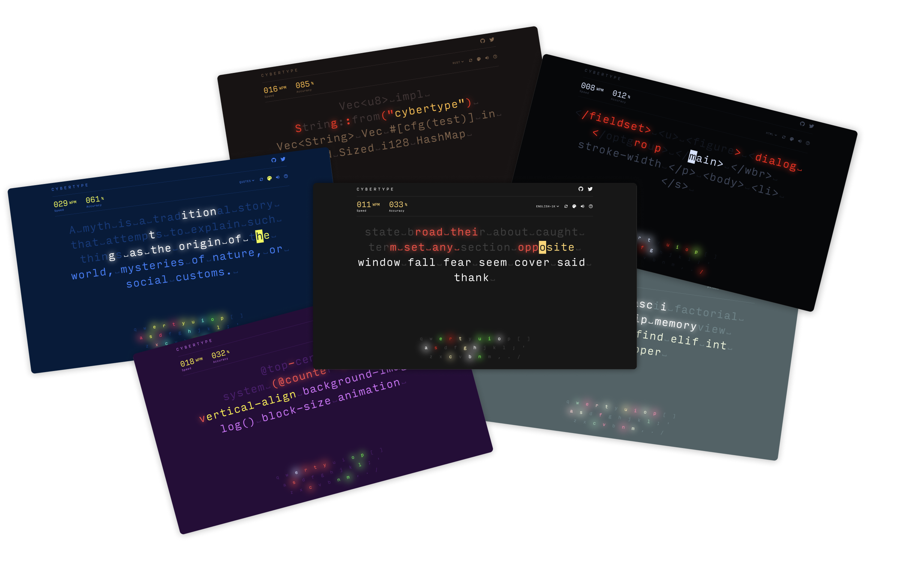
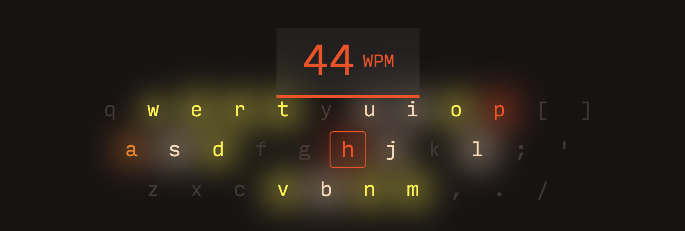
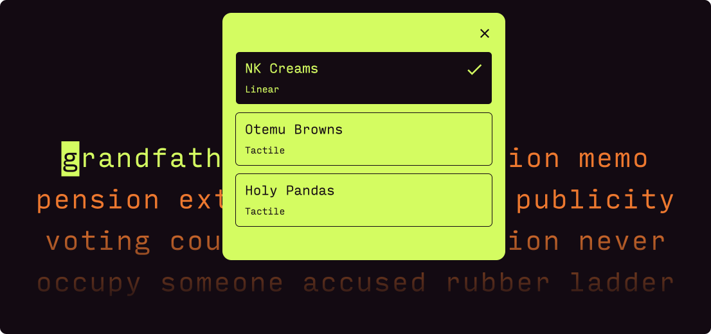
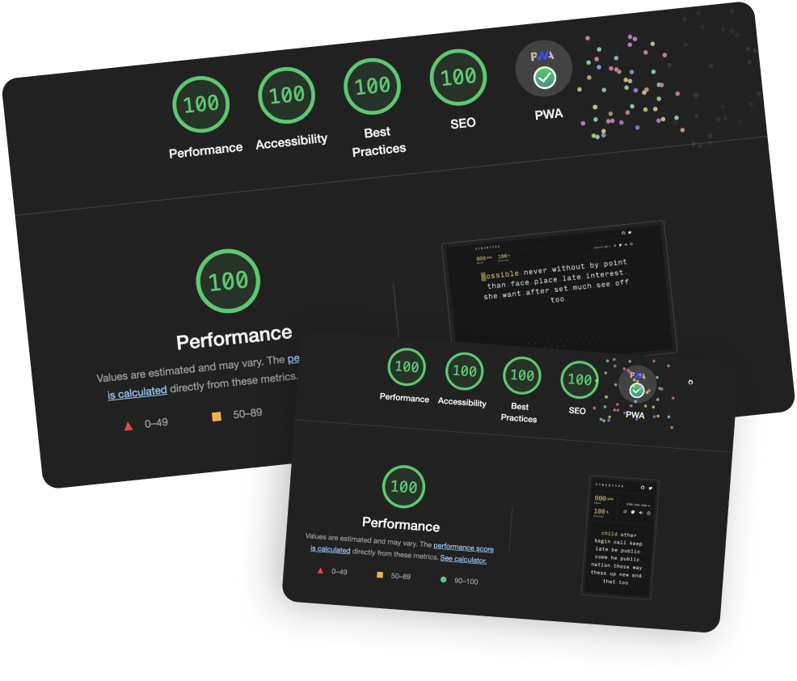

# cybertype.app

A Fast and Minimal Typing App.

Checkout [cybertype.app](https://cybertype.app/)

Practice typing in various modes such as common 1k, 5k, 10k English Words, most commonly misspelled words, Quotes or Programming Language keywords for various languages such as JavaScript, HTML, CSS, Rust, Python, C++ etc with Sweet Mechanical Keyboard Sounds.

 

## Awesome Themes

 

## Speed Heatmap

Find your weakness and keep practicing to improve your typing speed.

 

## Mechanical Keyboard Sounds

 

## Super Fast, Minimal and Installable 💯

It is a Progressive Web app that can be installed and can work 100% offline.

### Created with

- `TypeScript`
- `Next.js`,
- `React`
- `SCSS`
- `use-immer`, `howler`, `next-pwa`

 
 

### Credits for Data Collection

JSON Data for various languages is collected from the amazing [MonkeyType](https://github.com/monkeytypegame/monkeytype) Repository.
